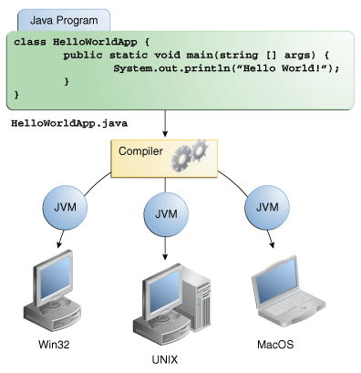

- [关于Java技术](#%e5%85%b3%e4%ba%8ejava%e6%8a%80%e6%9c%af)
  - [Java编程语言](#java%e7%bc%96%e7%a8%8b%e8%af%ad%e8%a8%80)
  - [Java平台](#java%e5%b9%b3%e5%8f%b0)
- [Java技术可以做什么](#java%e6%8a%80%e6%9c%af%e5%8f%af%e4%bb%a5%e5%81%9a%e4%bb%80%e4%b9%88)
- [Java技术将如何改变我的生活](#java%e6%8a%80%e6%9c%af%e5%b0%86%e5%a6%82%e4%bd%95%e6%94%b9%e5%8f%98%e6%88%91%e7%9a%84%e7%94%9f%e6%b4%bb)
# 关于Java技术
> Java技术既是一种编程语言，又是一个平台。
## Java编程语言
> Java编程语言是一种高级语言，可以用以下所有术语来描述：
> - 简单
> - 面向对象
> - 分布式
> - 多线程
> - 动态
> - 结构中立性
> - 可移植
> - 高性能
> - 强健
> - 安全

> 前面提到的每个术语都在Java语言环境中进行了解释，该环境是由James Gosling和Henry McGilton编写的白皮书。

> 在Java编程语言中，所有源代码都是首先以. Java扩展名结尾的纯文本文件编写的。然后，javac编译器将这些源文件编译成.class文件。类文件不包含处理器本机代码;相反，它包含字节码，即Java Virtual Machine1 (Java VM)的机器语言。然后，java启动程序工具使用java虚拟机实例运行您的应用程序。

  
**`An overview of the software development process.`**

> 因为Java VM可以在许多不同的操作系统上使用，所以相同的.class文件可以在Microsoft Windows、Solaris操作系统(Solaris OS)、Linux或Mac OS上运行。有些虚拟机(如Java SE HotSpot at a Glance)在运行时执行额外的步骤，以提高应用程序的性能。这包括各种任务，如查找性能瓶颈和重新编译(到本机代码)经常使用的代码段。

  
**`通过Java VM，同一个应用程序可以在多个平台上运行。`**
## Java平台
> 平台是程序运行的硬件或软件环境。我们已经提到了一些最流行的平台，比如Microsoft Windows、Linux、Solaris OS和Mac OS。大多数平台可以被描述为操作系统和底层硬件的组合。Java平台与大多数其他平台的不同之处在于，它是一个运行在其他基于硬件的平台之上的纯软件平台。

> Java平台有两个组件:
> - Java虚拟机
> - Java应用程序编程接口(API)

> 您已经了解了Java虚拟机;它是Java平台的基础，并被移植到各种基于硬件的平台上。

> API是大量现成的软件组件的集合，提供了许多有用的功能。它被分成相关类和接口的库;这些库称为包。下一节，Java技术可以做什么?突出显示API提供的一些功能。

  
**`API和Java虚拟机将程序与底层硬件隔离。`**

> 作为一个独立于平台的环境，Java平台可能比本地代码慢一些。然而，编译器和虚拟机技术的进步正在使性能接近本机代码，同时又不会威胁到可移植性。

> 术语“Java虚拟机”和“JVM”是指用于Java平台的虚拟机。
# Java技术可以做什么
> 通用的高级Java编程语言是一个强大的软件平台。Java平台的每个完整实现都提供了以下特性
> - **`开发工具`**:开发工具提供了编译、运行、监视、调试和记录应用程序所需的一切。作为一名新开发人员，您将使用的主要工具是javac编译器、java启动程序和javadoc文档工具。
> - **`应用程序编程接口(API)`**: API提供Java编程语言的核心功能。它提供了大量有用的类，可以在您自己的应用程序中使用。它涵盖了从基本对象、到网络和安全、到XML生成和数据库访问等所有方面。
> - **`部署技术`**:JDK软件提供了标准的机制，如用于将应用程序部署到最终用户的Java Web Start软件和Java插件软件。
> - **`用户界面工具包`**:JavaFX、Swing和Java 2D工具包使创建复杂的图形用户界面(gui)成为可能。
> - **`集成库`**:诸如Java IDL API、JDBC API、Java命名和目录接口(JNDI) API、Java RMI和通过Internet orb间协议技术(Java RMI- iiop技术)进行的Java远程方法调用等集成库支持对远程对象的数据库访问和操作。

# Java技术将如何改变我的生活
> 如果你学习Java编程语言，我们无法向你承诺名誉、财富甚至工作。尽管如此，它仍可能使您的程序比其他语言更好，并且需要的工作量更少。我们相信Java技术将帮助您完成以下工作
> - 快速入门:尽管Java编程语言是一种强大的面向对象语言，但它很容易学习，特别是对于已经熟悉C或c++的程序员。
> - 编写更少的代码:对程序度量(类计数、方法计数等)的比较表明，用Java编程语言编写的程序可能比用c++编写的相同程序小四倍。
> - 编写更好的代码:Java编程语言鼓励良好的编码实践，而自动垃圾收集有助于避免内存泄漏。它的面向对象、JavaBeans组件体系结构和广泛的、易于扩展的API允许您重用现有的、经过测试的代码并引入更少的bug。
> - 更快地开发程序:Java编程语言比c++更简单，因此，在用Java编写程序时，您的开发时间可能比c++快两倍。您的程序也将需要更少的代码行。
> - 避免平台依赖:通过避免使用其他语言编写的库，可以保持程序的可移植性。
> - 一次编写，随处运行:因为用Java编程语言编写的应用程序被编译成与机器无关的字节码，所以它们可以在任何Java平台上一致地运行。
> - 更容易地分发软件:使用Java Web Start软件，用户只需单击鼠标就可以启动应用程序。启动时的自动版本检查确保用户始终与软件的最新版本保持同步。如果有更新可用，Java Web Start软件将自动更新它们的安装。