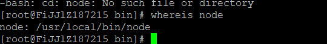
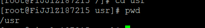
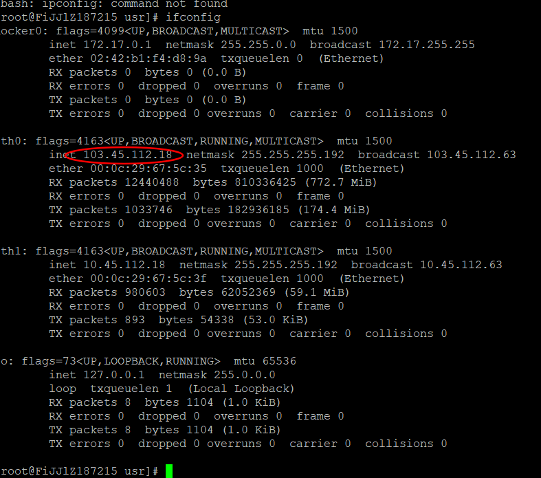
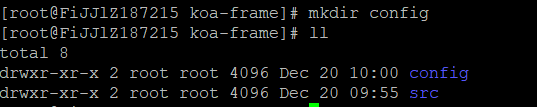
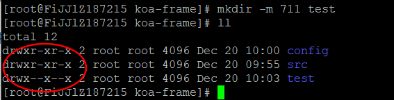
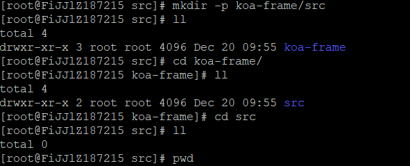

- [查询安装的软件所在目录](#%e6%9f%a5%e8%af%a2%e5%ae%89%e8%a3%85%e7%9a%84%e8%bd%af%e4%bb%b6%e6%89%80%e5%9c%a8%e7%9b%ae%e5%bd%95)
- [查看当前所在目录](#%e6%9f%a5%e7%9c%8b%e5%bd%93%e5%89%8d%e6%89%80%e5%9c%a8%e7%9b%ae%e5%bd%95)
- [查看本机ip](#%e6%9f%a5%e7%9c%8b%e6%9c%ac%e6%9c%baip)
- [查看进程](#%e6%9f%a5%e7%9c%8b%e8%bf%9b%e7%a8%8b)
- [杀死进程](#%e6%9d%80%e6%ad%bb%e8%bf%9b%e7%a8%8b)
- [查看开放了哪些端口](#%e6%9f%a5%e7%9c%8b%e5%bc%80%e6%94%be%e4%ba%86%e5%93%aa%e4%ba%9b%e7%ab%af%e5%8f%a3)
- [开放端口](#%e5%bc%80%e6%94%be%e7%ab%af%e5%8f%a3)
- [关闭端口](#%e5%85%b3%e9%97%ad%e7%ab%af%e5%8f%a3)
- [创建目录](#%e5%88%9b%e5%bb%ba%e7%9b%ae%e5%bd%95)
- [把命令的输出打印到屏幕的同时写入文件中](#%e6%8a%8a%e5%91%bd%e4%bb%a4%e7%9a%84%e8%be%93%e5%87%ba%e6%89%93%e5%8d%b0%e5%88%b0%e5%b1%8f%e5%b9%95%e7%9a%84%e5%90%8c%e6%97%b6%e5%86%99%e5%85%a5%e6%96%87%e4%bb%b6%e4%b8%ad)
# 查询安装的软件所在目录
```linux
whereis python3
```

# 查看当前所在目录
```linux
pwd
```

# 查看本机ip
```linux
ifconfig
```

# 查看进程
```linux
netstat -ntpl (TCP类型的端口)
```
**参数**
- a 表示所有
- n 表示不查询dns

- t 表示tcp协议

- u 表示udp协议

- p 表示查询占用的程序

- l 表示查询正在监听的程序
# 杀死进程
> 执行kill（默认kill -15）命令，系统会发送一个SIGTERM信号给对应的程序,大部分程序接收到SIGTERM信号后，会先释放自己的资源，然后再停止。
```linux
kill -15 pid
```
> kill -9命令，系统给对应程序发送的信号是SIGKILL，即exit。exit信号不会被系统阻塞，所以kill -9能顺利杀掉进程
```linux
kill -9 pid
```
# 查看开放了哪些端口
```linux
iptables -L -n
```

# 开放端口
```linux
iptables -I INPUT -p tcp --dport 8889 -j ACCEPT
```
# 关闭端口
```linux
iptables -A INPUT -p tcp --dport 8889 -j DROP
```
# 创建目录
> mkdir 命令的基本格式为：
 ```linux
[root@localhost ~]# mkdir [-mp] 目录名
```

- `-m` 选项用于手动配置所创建目录的权限，而不再使用默认权限。

- `-p` 选项递归创建所有目录，以创建 /home/test/demo 为例，在默认情况下，你需要一层一层的创建各个目录，而使用 -p 选项，则系统会自动帮你创建 /home、/home/test 以及 /home/test/demo。

# 把命令的输出打印到屏幕的同时写入文件中
//运行svndown命令，把svndown的输出信息通过管道传给sed,

// sed把输入信息写到svndown.svn文件中且把信息打印到屏幕上

svndown|sed 'w svndown.svn'