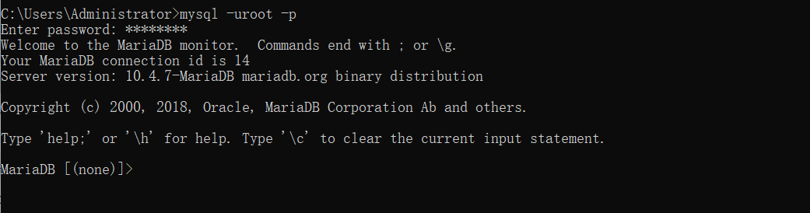
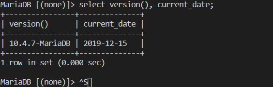
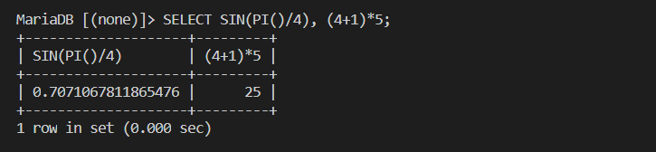
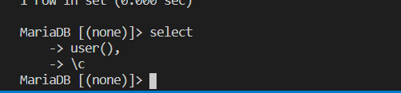

- [连接和断开与服务器的连接](#%e8%bf%9e%e6%8e%a5%e5%92%8c%e6%96%ad%e5%bc%80%e4%b8%8e%e6%9c%8d%e5%8a%a1%e5%99%a8%e7%9a%84%e8%bf%9e%e6%8e%a5)
- [进入查询](#%e8%bf%9b%e5%85%a5%e6%9f%a5%e8%af%a2)
- [创建和使用数据库](#%e5%88%9b%e5%bb%ba%e5%92%8c%e4%bd%bf%e7%94%a8%e6%95%b0%e6%8d%ae%e5%ba%93)
  - [创建和选择数据库](#%e5%88%9b%e5%bb%ba%e5%92%8c%e9%80%89%e6%8b%a9%e6%95%b0%e6%8d%ae%e5%ba%93)
  - [建表](#%e5%bb%ba%e8%a1%a8)
# 连接和断开与服务器的连接
> 要连接到服务器，通常需要在调用MySQL时提供一个MySQL用户名，很可能还需要一个密码。如果服务器运行在您登录的机器之外的机器上，您还需要指定主机名。请与管理员联系，了解应该使用什么连接参数进行连接(用什么主机、用户名和密码)。一旦你知道正确的参数，你应该能够像这样连接:
```shell
shell> mysql -h host -u user -p
Enter password: ********
```
> `host`和`user`表示MySQL服务器所在的主机名和MySQL帐户的用户名。为您的设置替换适当的值。********表示您的密码;当mysql显示`Enter password:`提示时输入。

> 如果可以，您应该看到一些介绍性信息，后面是一个mysql>提示符


> mysql>提示符告诉您，mysql已经为您输入SQL语句做好了准备。

> 如果您登录的是MySQL正在运行的同一台机器，那么您可以忽略主机，只使用以下命令:

```shell
shell> mysql -u user -p
```
> 如果，当你尝试登录时，你得到一个错误消息，如`error 2002 (HY000):无法通过socket '/tmp/mysql.sock'连接到本地MySQL服务器`，这意味着MySQL服务器守护进程(Unix)或服务(Windows)没有运行。

> 一些MySQL安装允许用户以匿名(未命名)用户的身份连接到本地主机上运行的服务器。如果在您的机器上是这种情况，您应该能够通过调用mysql连接到服务器，而不需要任何选项:
 ```shell
shell> mysql
```
> 成功连接后，您可以在mysql>提示符下输入QUIT(或\q)来断开连接
```shell
mysql> QUIT
```
# 进入查询
> 确保您已连接到服务器，如前一节所述。这样做本身并没有选择要使用的数据库，但这是可以的。此时，了解一下如何发出查询比直接创建表、将数据加载到表中以及从表中检索数据更重要。本节描述了输入查询的基本原则，您可以尝试使用几个查询来熟悉mysql的工作原理。

> 下面是一个简单的查询，要求服务器告诉您它的版本号和当前日期。如下所示，在mysql>提示符后键入它，然后回车:



> 这个查询说明了mysql的几个特点
> - 查询通常由一个SQL语句和一个分号组成。(有一些例外，分号可以省略。前面提到过，退出就是其中之一。)
> - 当您发出一个查询时，mysql将它发送到服务器执行并显示结果，然后打印另一个mysql>提示符，表明它已经准备好进行另一个查询。
> - mysql以表格形式(行和列)显示查询输出。第一行包含列的标签。下面的行是查询结果。通常，列标签是从数据库表中获取的列的名称。如果检索的是表达式的值而不是表列(如刚才显示的示例所示)，mysql使用表达式本身来标记列。
> mysql显示了返回了多少行以及查询执行了多长时间，这让您大致了解了服务器的性能。这些值并不精确，因为它们表示的是挂钟时间(而不是CPU或机器时间)，并且受到服务器负载和网络延迟等因素的影响。(为简单起见，本章其余的示例中有时不显示set行中的行。)

> 关键字可以输入在任何字母大小写。下面的查询是等价的
```shell
mysql> SELECT VERSION(), CURRENT_DATE;
mysql> select version(), current_date;
mysql> SeLeCt vErSiOn(), current_DATE;
```

> 这里是另一个查询。它演示了如何使用mysql作为一个简单的计算器


> 到目前为止显示的查询都是相对较短的单行语句。您甚至可以在一行中输入多个语句。用分号结尾就可以了


> 一个查询不需要在一行中给出所有内容，所以需要多行内容的冗长查询不是问题。mysql通过查找结束分号来确定语句的结尾，而不是通过查找输入行的结尾。(换句话说，mysql接受自由格式的输入:它收集输入行，但直到看到分号才执行它们。)  
> 下面是一个简单的多行语句


> 在本例中，请注意在您输入多行查询的第一行之后，提示符是如何从mysql>变为->的。这就是mysql表示它还没有看到完整的语句，正在等待其他语句的方式。提示是你的朋友，因为它提供了有价值的反馈。如果你使用反馈，你总是可以知道mysql在等待什么。

> 如果您决定不执行正在输入的查询，可以通过输入\c取消它:


> 这里也要注意提示符。在您输入\c之后，它会切换回mysql>，提供反馈以指示mysql已经准备好进行新的查询。

> 下表显示了您可能看到的每个提示，并总结了它们对于mysql所处状态的含义。

| 提示 | 含义 |
| :-: | :-: |
| mysql> | 准备好新的查询 |
| -> | 等待下一行多行查询 |
| '> | 等待下一行，等待以单引号(')开头的字符串的完成 |
| "> | 等待下一行，等待以双引号(")开头的字符串的完成 |
| `> | 等待下一行，等待以反号(')开头的标识符的完成 |
| /*> | 等待下一行，等待以/*开头的标识符的完成 |

> 当您打算对单行发出查询时，但是忘记终止分号。多行语句会意外出现，在这种情况下，mysql会等待更多的输入
```shell
mysql> SELECT USER()
    ->
```
> 如果这种情况发生在您身上(您认为您已经输入了一条语句，但是惟一的响应是一个->提示符)，那么mysql很可能正在等待分号。如果你没有注意到提示告诉你什么，你可能会坐在那里一段时间，然后才意识到你需要做什么。输入一个分号来完成语句，然后mysql执行它
```shell
mysql> SELECT USER()
    -> ;
```

> `'>`和`">`提示出现在字符串收集期间(另一种说法是MySQL正在等待一个字符串的完成)。在MySQL中，你可以用'或"字符(例如'hello'或' goodbye ')来写字符串，MySQL允许你输入跨多行的字符串。当您看到`'>`或`">`提示符时，这意味着您已经输入了以`'`或`"`引号开头的字符串，但是还没有输入结束字符串的匹配引号。这通常表示您无意中遗漏了引号字符。例如
```shell
mysql> SELECT * FROM my_table WHERE name = 'Smith AND age < 30;
    '>
```

> 如果您输入这个SELECT语句，然后按enter并等待结果，则什么也不会发生。请注意'>提示符提供的线索，而不是奇怪为什么这个查询要花这么长时间。它告诉你mysql希望看到未终止字符串的其余部分。你看到报表中的错误了吗?字符串'Smith缺少第二个单引号。)

> 在这一点上，你会怎么做?最简单的方法是取消查询。但是，在本例中不能只输入\c，因为mysql将其解释为正在收集的字符串的一部分。相反，输入结束引号字符(以便mysql知道您已经完成了字符串)，然后输入\c
```shell
mysql> SELECT * FROM my_table WHERE name = 'Smith AND age < 30;
    '> '\c
```
# 创建和使用数据库
> 一旦知道如何输入SQL语句，就可以访问数据库了。
## 创建和选择数据库
> 如果管理员在设置权限时为您创建了数据库，您可以开始使用它。否则，您需要自己创建它
```shell
mysql> CREATE DATABASE menagerie;
```
> 创建一个数据库并没有选择它使用;你必须明确地那样做。要使menagerie成为当前数据库，请使用此语句：
```shell
mysql> USE menagerie
Database changed
```
> 只需要创建一次数据库，但是每次开始mysql会话时都必须选择它。可以通过发出一个USE语句来实现这一点，如示例所示。或者，您可以在调用mysql时在命令行上选择数据库。只需在需要提供的连接参数之后指定它的名称。例如:
```shell
shell> mysql -h host -u user -p menagerie
Enter password: ********
```
> <font color="red">刚才显示的命令中的menagerie不是您的密码。如果您希望在-p选项之后的命令行上提供您的密码，则必须在没有空格的情况下提供(例如，作为`-ppassword`，而不是作为`-p password`)。但是，不建议在命令行中输入密码，因为这样做会使登录到您的计算机上的其他用户窥探您的密码。</font>
## 建表
