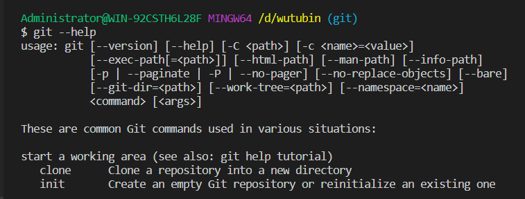
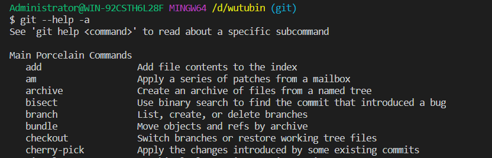

- [git](#git)
  - [名称](#%e5%90%8d%e7%a7%b0)
  - [概要](#%e6%a6%82%e8%a6%81)
  - [描述](#%e6%8f%8f%e8%bf%b0)
  - [选项](#%e9%80%89%e9%a1%b9)
# git
## 名称
`git` - 傻瓜式的内容跟踪器
## 概要
```git
git [--version] [--help] [-C <path>] [-c <name>=<value>]
    [--exec-path[=<path>]] [--html-path] [--man-path] [--info-path]
    [-p|--paginate|-P|--no-pager] [--no-replace-objects] [--bare]
    [--git-dir=<path>] [--work-tree=<path>] [--namespace=<name>]
    [--super-prefix=<path>]
    <command> [<args>]
```
## 描述
> Git是一个快速的、可扩展的分布式修订控制系统，它具有非常丰富的命令集，可以提供高级操作和对内部的完全访问。

## 选项
`--version`
> 打印Git程序的Git套件版本。
> 

`--help`
> 打印概要和最常用命令的列表。如果提供了all或-a选项，则打印所有可用命令。如果Git命令被命名，这个选项将打开该命令的手册页面。



> 打开一个add命令手册
```gig
git --help add
```
`-C <path>`
> 就像git是在\<path>中而不是当前工作目录中启动的一样运行。当提供多个-C选项时，每个后续的非绝对-C <路径>相对于前一个-C <路径>被解释。如果\<path>是空的，例如-C ""，则当前工作目录保持不变。

> 这个选项影响期望路径名的选项，比如——git-dir和——work-tree，因为它们对路径名的解释将相对于由-C选项引起的工作目录。例如，下面的调用是等价的:
```git
git --git-dir=a.git --work-tree=b -C c status
git --git-dir=c/a.git --work-tree=c/b status
```
> git -C \<other-git-repo-path> [git-command] 指定其它路径的仓库 执行命令
  

`-c <name>=<value>`
> 将配置参数传递给命令。给定的值将覆盖配置文件中的值。\<name>的格式应该与git配置中列出的格式相同(子键由点分隔)。

> 注意，在`git -c foo.bar ...`中省略了是允许的，并设置foo.bar转换为布尔值true(就像配置文件中的[foo]bar一样)。包含等号，但是用了一个空值(如git -c foo.bar=...)设置boo.bar成一个空字符串，git config --type回转换成false

> 在执行git命令时，添加这样的一个参数将使用新的value值替换掉config文件中name对应的参数配置的值来执行命令，示例如下：
```git
git -c bare=false status
```
`--exec-path[=<path>]`
> 安装核心Git程序的路径。这也可以通过设置GIT EXEC PATH环境变量来控制。如果没有给出路径，git将打印当前设置，然后退出。


`--html-path`
> 打印Git的HTML文档安装并退出的路径，不带斜杠。


`--man-path`
> 打印此版本git的手册所在路径并退出


`--info-path`
> 打印记录Git版本的信息文件所在的路径并退出。


`-p`  
`--paginate`
> 如果标准输出是终端, 则将所有输出管道更少（或如果设置为$ PAGER）, 这将覆盖pager.<cmd> 配置选项。

> 简单的说，就是以终端大小进行分页。

`--no-pager`
> 不要将Git输出管道传输到寻呼机

> 就是不分页，一次性打印

`--git-dir=<path>`
> 设置存储库的路径, 可以通过设置GIT_DIR环境变量来控制, 可以是当前工作目录的绝对或相对路径

`--work-tree=<path>`
> 设置工作树的路径。它可以是相对于当前工作目录的绝对路径或路径。这也可以通过设置GIT_WORK_TREE环境变量和core.worktree配置变量来控制（参见git-config（1）中的core.worktree 进行更详细的讨论）。

`--namespace=<path>`
> 设置Git命名空间。有关详细信息，请参阅gitnamespaces（7）。相当于设置GIT_NAMESPACE环境变量。

`--super-prefix=<path>`
> 目前仅供内部使用。设置一个前缀，该前缀从存储库上方到根的路径。一个用途是给调用它的超级项目的子模块上下文。

`--bare`
> 将存储库视为裸机箱。如果GIT_DIR环境未设置，则将其设置为当前工作目录。

`--no-replace-objects`
> 不要使用替换参考来替换Git对象。有关详细信息，请参阅 git-replace（1）。

`--literal-pathspecs`
> 以字面意思来对待路径（即没有全局，没有pathspec的魔法）。这相当于将GIT_LITERAL_PATHSPECS环境变量设置为1。

`--glob-pathspecs`
> 添加“glob”魔术到所有路径。这相当于将GIT_GLOB_PATHSPECS环境变量设置为1。禁用各个路径上的globbing可以使用pathspec magic“：（literal）”

`--noglob-pathspecs`
> 为所有路径添加“文字”魔法。这相当于将GIT_NOGLOB_PATHSPECS环境变量设置为1。在各个路径上启用globbing可以使用pathspec magic“：（glob）”

`--icase-pathspecs`
> 向所有路径添加“icase”魔术。这相当于将GIT_ICASE_PATHSPECS环境变量设置为1

`--no-optional-locks`
不要执行需要锁的可选操作。这相当于将GIT可选锁设置为0。

