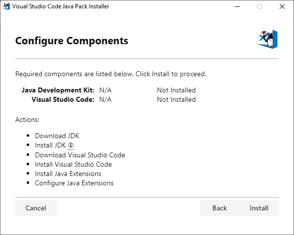

# 使用Visual Studio代码编写Java
> 本教程向您展示了如何使用Visual Studio代码在Java中编写和运行一个简单的Hello World程序。

**开始之前**
> 在阅读本教程之前，您必须在本地开发环境中使用Java SE开发工具包(JDK)。如果还没有安装，现在就可以安装。

> 下载并安装Java SE开发工具包(JDK)。Visual Studio代码上的Java支持适用于所有主要的Java版本(最多13个)，您可以从中选择一些JDK发行版

> 注意:安装JDK之后，需要为Java开发配置环境。最常见的方法是将JAVA HOME环境变量设置为JDK的安装位置，同时也可以使用在Visual Studio代码设置(工作区或用户设置)中的JAVA.home设置，以便仅为编辑器配置它。

> 为了帮助您快速入门，我们为Java开发人员创建了一个特殊的Visual Studio代码安装程序。
  
>[Download Visual Studio Code Java Pack Installer](https://aka.ms/vscode-java-installer-win)  

> 注意:安装程序目前仅适用于Windows。对于其他操作系统，请分别安装那些组件(JDK、VS代码和Java扩展)。

> 该包可以用作现有开发环境的全新安装或更新，以添加Java或Visual Studio代码。下载并打开后，它会自动检测您的本地开发环境中是否有基本组件，包括JDK、Visual Studio代码和必要的Java扩展。在安装期间，它从可信的在线资源下载这些工具的稳定版本，然后在您的系统上安装和配置它们。  
  
> 或者，您也可以通过自己安装流行的Java扩展，将Java语言支持添加到VS代码中。