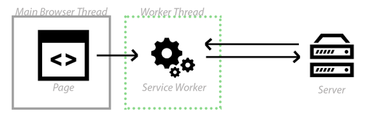
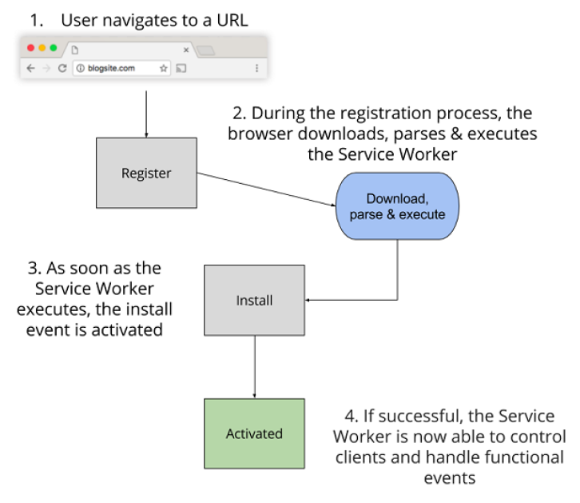

- [一、背景](#%e4%b8%80%e8%83%8c%e6%99%af)
- [二、What's PWA?](#%e4%ba%8cwhats-pwa)
- [三、PWA的实现](#%e4%b8%89pwa%e7%9a%84%e5%ae%9e%e7%8e%b0)
  - [3.1 Manifest实现添加至主屏幕](#31-manifest%e5%ae%9e%e7%8e%b0%e6%b7%bb%e5%8a%a0%e8%87%b3%e4%b8%bb%e5%b1%8f%e5%b9%95)
  - [3.2 service worker实现离线缓存](#32-service-worker%e5%ae%9e%e7%8e%b0%e7%a6%bb%e7%ba%bf%e7%bc%93%e5%ad%98)
    - [3.2.1 什么是service worker](#321-%e4%bb%80%e4%b9%88%e6%98%afservice-worker)
    - [3.2.2 HTTP缓存与service worker缓存](#322-http%e7%bc%93%e5%ad%98%e4%b8%8eservice-worker%e7%bc%93%e5%ad%98)
    - [3.2.3 实现离线缓存](#323-%e5%ae%9e%e7%8e%b0%e7%a6%bb%e7%ba%bf%e7%bc%93%e5%ad%98)
- [总结](#%e6%80%bb%e7%bb%93)
  - [PWA的优势](#pwa%e7%9a%84%e4%bc%98%e5%8a%bf)
  - [PWA存在的问题](#pwa%e5%ad%98%e5%9c%a8%e7%9a%84%e9%97%ae%e9%a2%98)


https://segmentfault.com/a/1190000012353473
# 一、背景
大家都知道Native app体验确实很好，下载到手机上之后入口也方便。它也有一些缺点:
- 开发成本高(ios和安卓)
- 软件上线需要审核
- 版本更新需要将新版本上传到不同的应用商店
- 想使用一个app就必须去下载才能使用，即使是偶尔需要使用一下下
  
而web网页开发成本低，网站更新时上传最新的资源到服务器即可，用手机带的浏览器打开就可以使用。但是除了体验上比Native app还是差一些，还有一些明显的缺点
- 手机桌面入口不够便捷，想要进入一个页面必须要记住它的url或者加入书签
- 没网络就没响应，不具备离线能力
- 不像APP一样能进行消息推送
那么什么是PWA呢？
# 二、What's PWA?
PWA全称Progressive Web App，即渐进式WEB应用。

一个 PWA 应用首先是一个网页, 可以通过 Web 技术编写出一个网页应用. 随后添加上 App Manifest(货单) 和 Service Worker 来实现 PWA 的安装和离线等功能
解决了哪些问题？

可以添加至主屏幕，点击主屏幕图标可以实现启动动画以及隐藏地址栏
实现离线缓存功能，即使用户手机没有网络，依然可以使用一些离线功能
实现了消息推送
它解决了上述提到的问题，这些特性将使得 Web 应用渐进式接近原生 App。
# 三、PWA的实现
## 3.1 Manifest实现添加至主屏幕
index.html
```html
<head>
  <title>Minimal PWA</title>
  <meta name="viewport" content="width=device-width, user-scalable=no" />
  <link rel="manifest" href="manifest.json" />
  <link rel="stylesheet" type="text/css" href="main.css">
  <link rel="icon" href="/e.png" type="image/png" />
</head>
```
manifest.json
```json
{
  "name": "Minimal PWA", // 必填 显示的插件名称
  "short_name": "PWA Demo", // 可选  在APP launcher和新的tab页显示，如果没有设置，则使用name
  "description": "The app that helps you understand PWA", //用于描述应用
  "display": "standalone", // 定义开发人员对Web应用程序的首选显示模式。standalone模式会有单独的
  "start_url": "/", // 应用启动时的url
  "theme_color": "#313131", // 桌面图标的背景色
  "background_color": "#313131", // 为web应用程序预定义的背景颜色。在启动web应用程序和加载应用程序的内容之间创建了一个平滑的过渡。
  "icons": [ // 桌面图标，是一个数组
    {
    "src": "icon/lowres.webp",
    "sizes": "48x48",  // 以空格分隔的图片尺寸
    "type": "image/webp"  // 帮助userAgent快速排除不支持的类型
  },
  {
    "src": "icon/lowres",
    "sizes": "48x48"
  },
  {
    "src": "icon/hd_hi.ico",
    "sizes": "72x72 96x96 128x128 256x256"
  },
  {
    "src": "icon/hd_hi.svg",
    "sizes": "72x72"
  }
  ]
}
```
Manifest参考文档：https://developer.mozilla.org/zh-CN/docs/Web/Manifest  
可以打开网站https://developers.google.cn/web/showcase/2015/chrome-dev-summit查看添加至主屏幕的动图。

如果用的是安卓手机，可以下载chrome浏览器自己操作看看
## 3.2 service worker实现离线缓存
### 3.2.1 什么是service worker
Service Worker 是 Chrome 团队提出和力推的一个 WEB API，用于给 web 应用提供高级的可持续的后台处理能力。



Service Workers 就像介于服务器和网页之间的拦截器，能够拦截进出的HTTP 请求，从而完全控制你的网站。

**最主要的特点**
- 在页面中注册并安装成功后，运行于浏览器后台，不受页面刷新的影响，可以监听和截拦作用域范围内所有页面的 HTTP 请求。
- 网站必须使用 HTTPS。除了使用本地开发环境调试时(如域名使用 localhost)
- 运行于浏览器后台，可以控制打开的作用域范围下所有的页面请求
- 单独的作用域范围，单独的运行环境和执行线程
- 不能操作页面 DOM。但可以通过事件机制来处理
- 事件驱动型服务线程
> 为什么要求网站必须是HTTPS的，大概是因为service worker权限太大能拦截所有页面的请求吧，如果http的网站安装service worker很容易被攻击

**生命周期**

当用户首次导航至 URL 时，服务器会返回响应的网页。

- 第1步:当你调用 register() 函数时， Service Worker 开始下载。
- 第2步:在注册过程中，浏览器会下载、解析并执行 Service Worker ()。如果在此步骤中出现任何错误，register() 返回的 promise 都会执行 reject 操作，并且 Service Worker 会被废弃。
- 第3步:一旦 Service Worker 成功执行了，install 事件就会激活
- 第4步:安装完成，Service Worker 便会激活，并控制在其范围内的一切。如果生命周期中的所有事件都成功了，Service Worker 便已准备就绪，随时可以使用了！

### 3.2.2 HTTP缓存与service worker缓存
- HTTP缓存
Web 服务器可以使用 Expires 首部来通知 Web 客户端，它可以使用资源的当前副本，直到指定的“过期时间”。反过来，浏览器可以缓存此资源，并且只有在有效期满后才会再次检查新版本。
使用 HTTP 缓存意味着你要依赖服务器来告诉你何时缓存资源和何时过期。

- service worker缓存
Service Workers 的强大在于它们拦截 HTTP 请求的能力
进入任何传入的 HTTP 请求，并决定想要如何响应。在你的 Service Worker 中，可以编写逻辑来决定想要缓存的资源，以及需要满足什么条件和资源需要缓存多久。一切尽归你掌控！

### 3.2.3 实现离线缓存
index.html
```html
<!DOCTYPE html>
<html>
  <head>
    <meta charset="UTF-8">
    <title>Hello Caching World!</title>
  </head>
  <body>
    <!-- Image -->
                     
    <!-- JavaScript -->
    <script async src="/js/script.js"></script>     
    <script>
      // 注册 service worker
      if ('serviceWorker' in navigator) {           
        navigator.serviceWorker.register('/service-worker.js', {scope: '/'}).then(function (registration) {
          // 注册成功
          console.log('ServiceWorker registration successful with scope: ', registration.scope);
        }).catch(function (err) {                   
          // 注册失败 :(
          console.log('ServiceWorker registration failed: ', err);
        });
      }
    </script>
  </body>
</html>
```
> 注：Service Worker 的注册路径决定了其 scope 默认作用页面的范围。
如果 service-worker.js 是在 /sw/ 页面路径下，这使得该 Service Worker 默认只会收到 页面/sw/ 路径下的 fetch 事件。
如果存放在网站的根路径下，则将会收到该网站的所有 fetch 事件。
如果希望改变它的作用域，可在第二个参数设置 scope 范围。示例中将其改为了根目录，即对整个站点生效。

service-worker.js
```js
var cacheName = 'helloWorld';     // 缓存的名称  
// install 事件，它发生在浏览器安装并注册 Service Worker 时        
self.addEventListener('install', event => { 
/* event.waitUtil 用于在安装成功之前执行一些预装逻辑
 但是建议只做一些轻量级和非常重要资源的缓存，减少安装失败的概率
 安装成功后 ServiceWorker 状态会从 installing 变为 installed */
  event.waitUntil(
    caches.open(cacheName)                  
    .then(cache => cache.addAll([    // 如果所有的文件都成功缓存了，便会安装完成。如果任何文件下载失败了，那么安装过程也会随之失败。        
      '/js/script.js',
      '/images/hello.png'
    ]))
  );
});
  
/**
为 fetch 事件添加一个事件监听器。接下来，使用 caches.match() 函数来检查传入的请求 URL 是否匹配当前缓存中存在的任何内容。如果存在的话，返回缓存的资源。
如果资源并不存在于缓存当中，通过网络来获取资源，并将获取到的资源添加到缓存中。
*/
self.addEventListener('fetch', function (event) {
  event.respondWith(
    caches.match(event.request)                  
    .then(function (response) {
      if (response) {                            
        return response;                         
      }
      var requestToCache = event.request.clone();  //          
      return fetch(requestToCache).then(                   
        function (response) {
          if (!response || response.status !== 200) {      
            return response;
          }
          var responseToCache = response.clone();          
          caches.open(cacheName)                           
            .then(function (cache) {
              cache.put(requestToCache, responseToCache);  
            });
          return response;             
    })
  );
});
```
> 注：为什么用request.clone()和response.clone()
需要这么做是因为request和response是一个流，它只能消耗一次。因为我们已经通过缓存消耗了一次，然后发起 HTTP 请求还要再消耗一次，所以我们需要在此时克隆请求
Clone the request—a request is a stream and can only be consumed once.
# 总结
## PWA的优势
- 可以将app的快捷方式放置到桌面上，全屏运行，与原生app无异
- 能够在各种网络环境下使用，包括网络差和断网条件下，不会显示undefind
- 推送消息的能力
- 其本质是一个网页，没有原生app的各种启动条件，快速响应用户指令
## PWA存在的问题
- 支持率不高:现在ios手机端不支持pwa，IE也暂时不支持
- Chrome在中国桌面版占有率还是不错的，安卓移动端上的占有率却很低
- 各大厂商还未明确支持pwa
- 依赖的GCM服务在国内无法使用
- 微信小程序的竞争
- 尽管有上述的一些缺点，PWA技术仍然有很多可以使用的点。

- service worker技术实现离线缓存，可以将一些不经常更改的静态文件放到缓存中，提升用户体验。
- service worker实现消息推送，使用浏览器推送功能，吸引用户
- 渐进式开发，尽管一些浏览器暂时不支持，可以利用上述技术给使用支持浏览器的用户带来更好的体验。