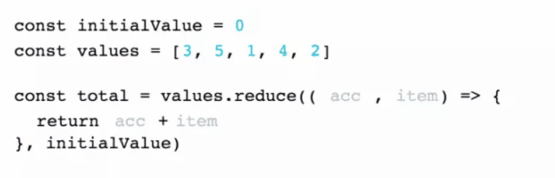

# Array
## 属性
## 方法
### reduce
* 定义：对数组中的每个元素执行一个自定义的累计器，将其结果汇总为单个返回值
* 形式：array.reduce((t, v, i, a) => {}, initValue)
* 参数
  * callback：回调函数(必选)
  * initValue：初始值(可选)

* 回调函数的参数
  * total(t)：累计器完成计算的返回值(必选)
  * value(v)：当前元素(必选)
  * index(i)：当前元素的索引(可选)
  * array(a)：当前元素所属的数组对象(可选)

* 过程

  * 以t作为累计结果的初始值，不设置t则以数组第一个元素为初始值
  * 开始遍历，使用累计器处理v，将v的映射结果累计到t上，结束此次循环，返回t
  * 进入下一次循环，重复上述操作，直至数组最后一个元素
  * 结束遍历，返回最终的t


reduce的精华所在是将累计器逐个作用于数组成员上，把上一次输出的值作为下一次输入的值。下面举个简单的栗子，看看reduce的计算结果。
```js
const arr = [3, 5, 1, 4, 2];
const a = arr.reduce((t, v) => t + v);
// 等同于
const b = arr.reduce((t, v) => t + v, 0);
```
复制代码代码不太明白没关系，贴一个reduce的作用动图应该就会明白了。

reduce实质上是一个累计器函数，通过用户自定义的累计器对数组成员进行自定义累计，得出一个由累计器生成的值。另外reduce还有一个胞弟reduceRight，两个方法的功能其实是一样的，只不过reduce是升序执行，reduceRight是降序执行。
对空数组调用reduce()和reduceRight()是不会执行其回调函数的，可认为reduce()对空数组无效