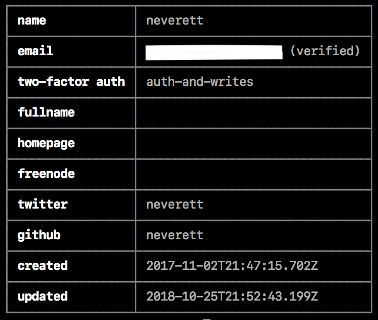

# 管理您的配置文件设置
您可以从web或命令行管理用户帐户配置文件的设置。
## 管理来自web的用户帐户配置文件设置
在web上，您可以更改以下用户配置文件设置:
* 头像
* 密码
* 全名
* GitHub用户名
* Twitter用户名
* 添加到包元数据的邮箱地址
* 双因素验证状态

1. 登录你的npm账号
2. 在页面的右上角，点击头像，在点击Profile Settings
## 从命令行管理用户帐户配置文件设置
> 注意:您的npm客户端必须是版本5.5.1或更高版本，才能从CLI更改您的帐户设置。要更新到npm的最新版本，在命令行上运行`npm install npm@latest -g`
### 从命令行查看用户帐户配置文件设置
要从命令行上的CLI查看用户配置文件设置，请运行以下命令:
```cli
npm profile get
```

### 从命令行更新用户帐户配置文件设置
在CLI中，您可以为您的用户帐户更改以下属性:
* 邮箱
* 双因素权限验证
* 全名
* 主页
* Twitter
* GitHub
* 密码
* freenode

1. 在命令行输入以下命令，用属性的名称替换属性，用新值替换值：
```cli
npm profile set <prop> <value>
```
2. 当提示时，键入你目前的密码
3. 如果您的帐户启用了双因素身份验证，在出现提示时，请输入一次性密码。
有关详细信息，请参阅配置文件命令行文档。
### 从命令行设置密码
1. 在命令键入下面命令：
```cli
npm profile set password
```
2. 当提示时，键入你目前的密码
3. 当提示时，键入一个新的密码
> 为了保护您的帐户，当您从命令行重置密码时，必须这样做:

* 长度超过10个字符
* 不包含您的部分用户名
* 不在常用密码列表中
* 不在“我被入侵”数据库中

### 从命令行配置双因素身份验证
对您的帐户启用双因素身份验证有助于防止未经授权的访问您的帐户和包。

要从命令行启用、配置和禁用双因素身份验证，请参阅配置双因素身份验证。