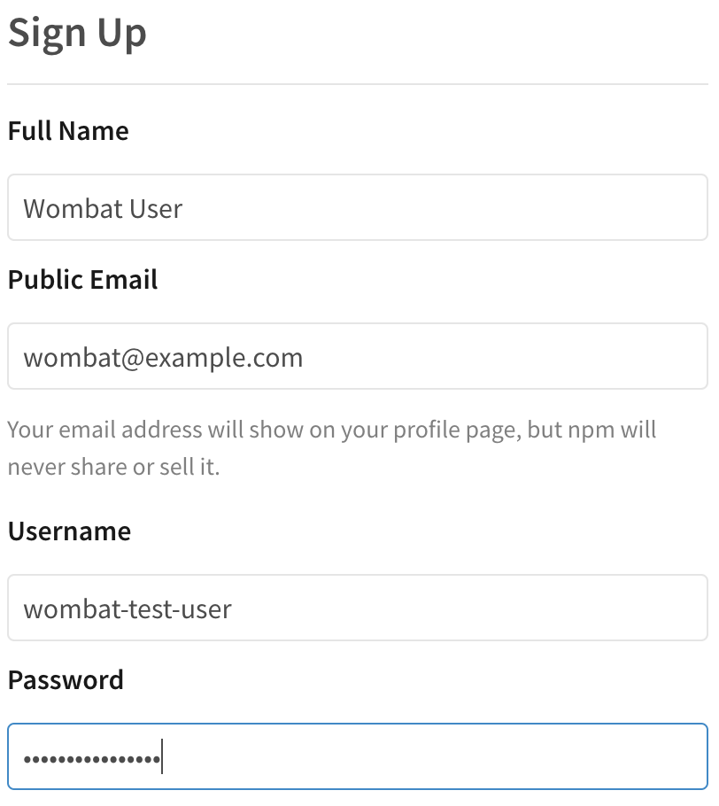

# 在公共注册表上创建新用户帐户
如果您还没有npm用户帐户，您可以创建一个帐户，以便在公共注册表上共享和下载Javascript包。
> 注意:如果您使用的是npm企业注册表，则必须使用SSO凭据登录，而不是创建帐户。有关更多信息，请与您公司的企业管理员联系。

## 在网站创建一个账号
1. 去到npm注册页面
2. 在用户注册表单的字段输入：
   * 全名
   * 公开邮箱：你的公开邮箱地址会被添加到你的包的元数据里，对下载你的包的用户是可见的。我们也将发送电子邮件到这个帐户当您更新包，以及偶尔的产品更新和信息。
   * 用户名：当您发布包或在npmjs.com上与其他npm用户交互时将显示的用户名。您的用户名必须是小写的，并且可以包含连字符和数字。
   * 密码：您的密码必须符合我们的密码指南。
3. 报名参加我们的电子邮件通讯，选择报名参加每周npm 
4. 选择同意最终用户许可协议和隐私政策
5. 单击创建帐户。
> 注意:注册npm帐户后，您将收到帐户验证电子邮件。您必须验证您的电子邮件地址，以便将包发布到注册中心。
## 用npm login 测试你的新账号
用`npm login`命令去测试登录你的新账号
> 注意:如果您在使用npm登录命令登录时拼错了现有帐户的用户名，您将创建一个名称拼错的新帐户。对于意外创建的帐户，请联系npm支持。
1. 在命令行中，键入以下命令替换
```cli
npm login
```
2. 当提示时，输入您的用户名、密码和电子邮件地址。
3. 如果启用了双因素身份验证，则在提示时输入一次性密码。
4. 要测试是否成功登录，请键入
```cli
npm whoami
```
应该显示您的npm用户名