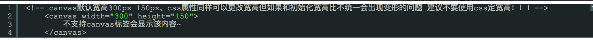
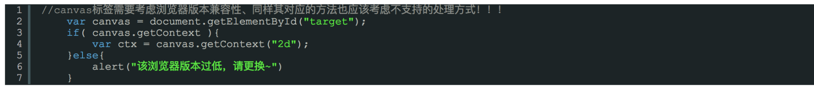
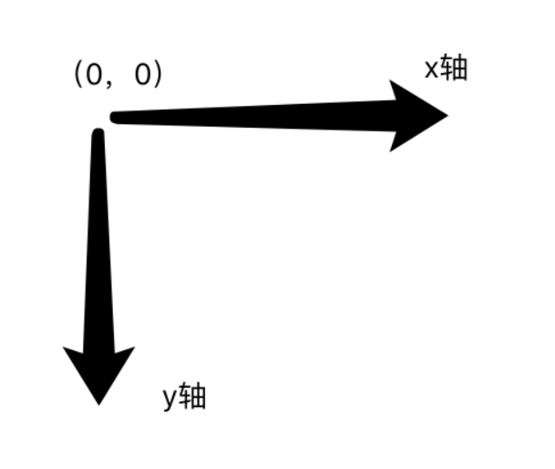

- [介绍](#%e4%bb%8b%e7%bb%8d)
- [关系](#%e5%85%b3%e7%b3%bb)
- [基本使用](#%e5%9f%ba%e6%9c%ac%e4%bd%bf%e7%94%a8)
- [api](#api)
  - [矩形](#%e7%9f%a9%e5%bd%a2)
    - [fillRect](#fillrect)
  - [圆弧](#%e5%9c%86%e5%bc%a7)
    - [arc](#arc)
# 介绍
> 不同于 SVG，\<canvas> 只支持两种形式的图形绘制：矩形和路径（由一系列点连成的线段）。

# 关系
Canvas标签的宽高属性决定了画布操作的大小：
```html
<canvas width=”200” height=”200”></canvas>
```
决定画布为200\*200，在ctx上下所操作的距离都是相对这里的200*200

Canvas的css属性宽高决定视觉上的大小：
```css
Canvas{
width: 100px;
Height: 50px;
}
```
在网页上呈现的大小为100px*50px,但是此时的canvas内容看起来变形，因为呈现的比例与画布的比例不一致导致。
- 呈现的比例为100:50 == 2:1,
- 画布的比例为200:200 == 1:1

# 基本使用
- **标签使用：**


- **检测支持性：**


- **绘制图形坐标：**


# api
## 矩形
### fillRect
绘制填充矩形,默认为黑色
 - **格式**
```js
let cxt = document.getElementById('canvas')
cxt.fillRect(x , y , width , height)
```
- **参数**
  - `x`:&emsp;矩形左上角的x轴坐标
  - `y`:&emsp;矩形左上角的y轴坐标
  - `width`:&emsp;矩形的宽度
  - `height`:&emsp;矩形的高度
 - **示例**
  ```js
  cxt.fillRect(10 , 10 , 100 , 100)
  ```
  ## 圆弧
  ### arc
  绘制圆弧,以(x,y)为圆心 r为半径的圆 绘制startAngle弧度 到endAngle弧度的圆弧 anticlosewise默认为false 即顺时针方向 true为逆时针方向
  - **格式**
  ```js
  let cxt = document.getElementById('canvas')
  cxt.arc( x , y , r , startAngle , endAngle , anticlosewise )
  ```
 - **参数**
    - `x`:&emsp;圆心的x轴坐标
    - `y`:&emsp;圆心的y轴坐标
    - `r`:&emsp;圆的半径
    - `startAngle`:&emsp;开始弧度
    - `endAngle`:&emsp;结束弧度
    - `anticlosewise`:&emsp;逆时针的