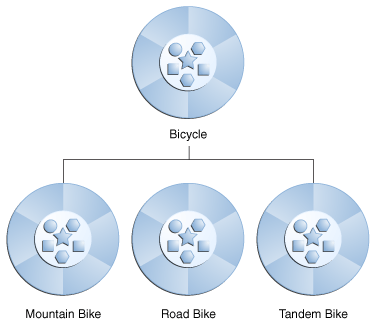

- [对象为何物](#%e5%af%b9%e8%b1%a1%e4%b8%ba%e4%bd%95%e7%89%a9)
- [什么是类](#%e4%bb%80%e4%b9%88%e6%98%af%e7%b1%bb)
- [什么是继承](#%e4%bb%80%e4%b9%88%e6%98%af%e7%bb%a7%e6%89%bf)
- [什么是接口](#%e4%bb%80%e4%b9%88%e6%98%af%e6%8e%a5%e5%8f%a3)
- [什么是包](#%e4%bb%80%e4%b9%88%e6%98%af%e5%8c%85)
> 如果您以前从未使用过面向对象的编程语言，那么在开始编写任何代码之前，您需要学习一些基本概念。本课将向您介绍对象、类、继承、接口和包。每个讨论都集中于这些概念如何与现实世界相关联，同时还介绍了Java编程语言的语法。

# 对象为何物
> 对象是理解面向对象技术的关键。环顾四周，你会发现许多真实世界的物体:你的狗、你的桌子、你的电视机、你的自行车。

> 现实世界中的对象有两个共同特征:它们都有状态和行为。狗有状态(名称、颜色、品种、饥饿)和行为(吠叫、取物、摇尾巴)。自行车也有状态(当前档位、当前踏板节奏、当前速度)和行为(换档、换踏板节奏、踩刹车)。从面向对象编程的角度出发，识别真实对象的状态和行为是一种很好的方法。

> 现在花一分钟观察一下你周围的真实世界。对于看到的每个对象，问自己两个问题:“这个对象可能处于什么状态?”和“这个对象可能执行什么行为?”一定要把你的观察记录下来。当你这样做时，你会注意到现实世界的对象在复杂性上是不同的;您的桌面灯可能只有两种可能的状态(打开和关闭)和两种可能的行为(打开、关闭)，但是您的桌面收音机可能有其他的状态(打开、关闭、当前音量、当前台)和行为(打开、关闭、增加音量，减少音量，查找，扫描和调整)。您可能还会注意到，有些对象也会包含其他对象。这些现实世界的观察都转化为面向对象编程的世界
 
>   
**`A software object`**  

>软件对象在概念上与现实世界的对象相似:它们也由状态和相关的行为组成。对象将其状态存储在字段(某些编程语言中的变量)中，并通过方法(某些编程语言中的函数)公开其行为。方法操作对象的内部状态，并充当对象到对象通信的主要机制。隐藏内部状态并要求所有交互都通过对象的方法来执行，这被称为数据封装，是面向对象编程的基本原则。

> 以自行车为例:
>   
> **`A bicycle modeled as a software object.`**

> 通过指定状态(当前速度、当前踏板节奏和当前齿轮)并提供改变该状态的方法，对象可以控制外部世界如何使用它。例如，如果自行车只有6个齿轮，那么换档方法可以拒绝任何小于1或大于6的值。

> 将代码绑定到单个软件对象提供了许多好处，包括:
> 
> 1. 模块化:一个对象的源代码可以独立于其他对象的源代码来编写和维护。一旦创建了对象，就可以很容易地在系统中传递。
> 2. 信息隐藏:通过只与对象的方法交互，其内部实现的细节对外界保持隐藏。
> 3. 代码重用:如果一个对象已经存在(可能是由另一个软件开发人员编写的)，您可以在程序中使用该对象。这允许专家实现/测试/调试复杂的、特定于任务的对象，然后您可以信任这些对象在您自己的代码中运行。
> 4. 可插拔性和调试简便性:如果某个特定对象出现问题，您可以简单地将其从应用程序中删除，并插入一个不同的对象作为其替代。这类似于解决现实世界中的机械问题。如果一个螺栓坏了，你可以更换它，而不是整个机器。
# 什么是类
> 类是创建对象的蓝图或原型。

> 在现实世界中，你经常会发现许多同类的独立物体。世界上可能还有成千上万辆其他的自行车，都是同样的牌子和型号。每一辆自行车都是由同一套蓝图建造的，因此包含了相同的部件。在面向对象术语中，我们说您的自行车是被称为自行车的对象类的一个实例。类是创建单个对象的蓝图。

> 下面的自行车类是自行车的一个可能实现
 ```java
class Bicycle {
    int cadence = 0;
    int speed = 0;
    int gear = 1;

    void changeCadence(int newValue) {
         cadence = newValue;
    }

    void changeGear(int newValue) {
         gear = newValue;
    }

    void speedUp(int increment) {
         speed = speed + increment;   
    }

    void applyBrakes(int decrement) {
         speed = speed - decrement;
    }

    void printStates() {
         System.out.println("cadence:" +
             cadence + " speed:" + 
             speed + " gear:" + gear);
    }
}
```
> Java编程语言的语法看起来很新，但是这个类的设计是基于前面对自行车对象的讨论。字段cadence、speed和gear表示对象的状态，而方法(changeCadence、changeGear、speedUp等)定义对象与外部世界的交互。

> 您可能已经注意到，Bicycle类不包含一个主方法。那是因为它不是一个完整的应用;这只是自行车的蓝图，可能会在应用中使用。创建和使用新的自行车对象的职责属于应用程序中的其他类。

> 下面是一个创建两个单独的Bicycle对象并调用它们的方法的脚踏车演示类
```java
class BicycleDemo {
    public static void main(String[] args) {

        // Create two different 
        // Bicycle objects
        Bicycle bike1 = new Bicycle();
        Bicycle bike2 = new Bicycle();

        // Invoke methods on 
        // those objects
        bike1.changeCadence(50);
        bike1.speedUp(10);
        bike1.changeGear(2);
        bike1.printStates();

        bike2.changeCadence(50);
        bike2.speedUp(10);
        bike2.changeGear(2);
        bike2.changeCadence(40);
        bike2.speedUp(10);
        bike2.changeGear(3);
        bike2.printStates();
    }
}
```
> 该测试的输出打印两辆自行车的结束踏板节奏、速度和齿轮
```java
cadence:50 speed:10 gear:2
cadence:40 speed:20 gear:3
```
# 什么是继承
> 继承为组织和构造您的软件提供了一种强大而自然的机制。

> 不同种类的物体常常有一定数量的共同之处。例如，山地自行车、公路自行车和双人自行车都具有自行车的特点(当前的速度、当前的踏板节奏、当前的档位)。然而，每一辆自行车都定义了使它们与众不同的附加功能:双人自行车有两个座位和两组把手;公路自行车有把手;一些山地自行车有一个额外的链环，给他们一个较低的传动比。

> 面向对象编程允许类从其他类继承常用的状态和行为。在本例中，自行车现在成为了山地车、公路自行车和TandemBike的超类。在Java编程语言中，每个类都允许有一个直接的超类，而每个超类都可能有无限个子类

> 
**`A hierarchy of bicycle classes.`**

> 创建子类的语法很简单。在类声明的开头，使用extends关键字，后跟要从中继承的类的名称:
```java
class MountainBike extends Bicycle {

    // new fields and methods defining 
    // a mountain bike would go here

}
```
> 这给了MountainBike与Bicycle相同的字段和方法，但允许其代码只关注使其独一无二的特性。这使得子类的代码易于阅读。但是，您必须注意适当地记录每个超类定义的状态和行为，因为这些代码不会出现在每个子类的源文件中。
# 什么是接口
> 接口是类与外部世界之间的契约。当一个类实现一个接口时，它承诺提供该接口发布的行为。

> 正如您已经了解的，对象通过它们公开的方法定义它们与外部世界的交互。方法形成对象与外界的接口;例如，电视机前面的按钮是你和塑料外壳另一边的电线之间的接口。你按下“电源”按钮来打开和关闭电视。

> 在其最常见的形式中，接口是一组具有空主体的相关方法。自行车的行为(如果指定为接口)可能如下所示:
```java
interface Bicycle {

    //  wheel revolutions per minute
    void changeCadence(int newValue);

    void changeGear(int newValue);

    void speedUp(int increment);

    void applyBrakes(int decrement);
}
```
> 要实现这个接口，您的类的名称将会更改(例如，更改为特定品牌的自行车，例如ACMEBicycle)，并且您将在类声明中使用implements关键字
```java
class ACMEBicycle implements Bicycle {

    int cadence = 0;
    int speed = 0;
    int gear = 1;

   // The compiler will now require that methods
   // changeCadence, changeGear, speedUp, and applyBrakes
   // all be implemented. Compilation will fail if those
   // methods are missing from this class.

    void changeCadence(int newValue) {
         cadence = newValue;
    }

    void changeGear(int newValue) {
         gear = newValue;
    }

    void speedUp(int increment) {
         speed = speed + increment;   
    }

    void applyBrakes(int decrement) {
         speed = speed - decrement;
    }

    void printStates() {
         System.out.println("cadence:" +
             cadence + " speed:" + 
             speed + " gear:" + gear);
    }
}
```
> 实现接口允许类对其承诺提供的行为更加正式。接口在类和外部世界之间形成一种契约，编译器在构建时强制执行这种契约。如果您的类声明要实现一个接口，则由该接口定义的所有方法必须出现在其源代码中，然后该类才能成功编译。

> <font color="red">注意:要实际编译ACMEBicycle类，需要在实现的接口方法的开头添加public关键字。稍后在关于类、对象、接口和继承的课程中，您将了解造成这种情况的原因。</font>
# 什么是包
> 包是一个以逻辑方式组织类和接口的名称空间。将代码放到包中使大型软件项目更容易管理。

> 包是组织一组相关类和接口的名称空间。从概念上讲，您可以认为包类似于计算机上的不同文件夹。您可以在一个文件夹中保存HTML页面，在另一个文件夹中保存图像，在另一个文件夹中保存脚本或应用程序。因为用Java编程语言编写的软件可以由数百或数千个单独的类组成，所以通过将相关的类和接口放入包中来保持组织是有意义的。

> Java平台提供了一个巨大的类库(一组包)，适合在您自己的应用程序中使用。这个库被称为“应用程序编程接口”，简称为“API”。它的包表示与通用编程最相关的任务。例如，一个字符串对象包含字符串的状态和行为;File对象允许程序员轻松地在文件系统上创建、删除、检查、比较或修改文件;套接字对象允许创建和使用网络套接字;各种GUI对象、控制按钮和复选框以及任何与图形用户界面相关的东西。有成千上万的类可供选择。这样，作为程序员的您就可以将重点放在特定应用程序的设计上，而不是放在使其工作所需的基础设施上。

> [Java平台API规范](https://docs.oracle.com/javase/8/docs/api/index.html)包含Java SE平台提供的所有包、接口、类、字段和方法的完整清单。在浏览器中加载该页面并将其添加到书签中。作为一个程序员，它将成为您最重要的参考文档。